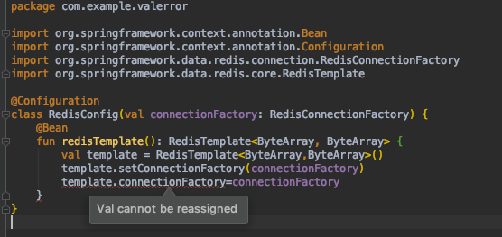

= Strange Compiler Error

Calling the `RedisTemplate.setConnectionFactory(...)` gives `Val cannot be reassigned`

[source,kotlin]
----
include::src/main/kotlin/com/example/valerror/RedisConfig.kt[]
----

